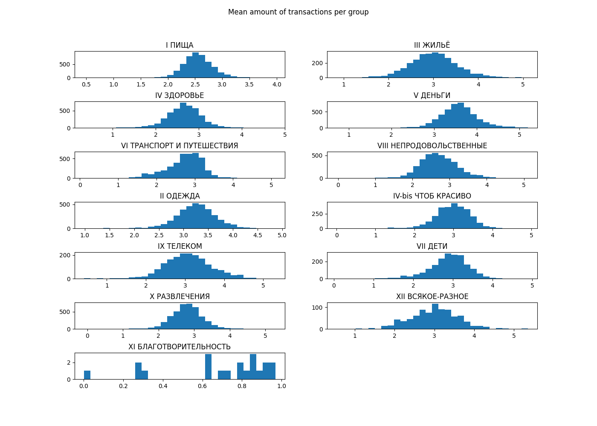
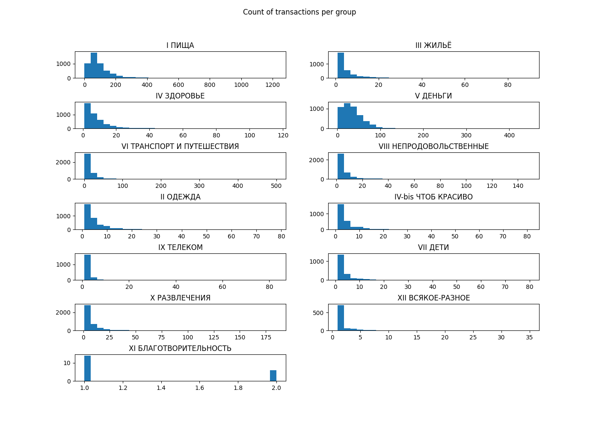
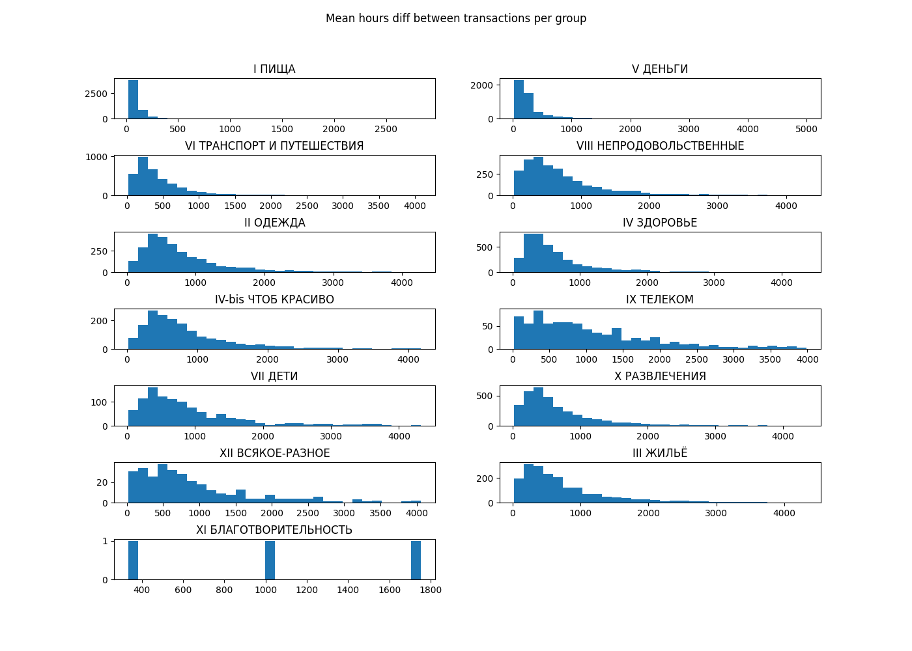
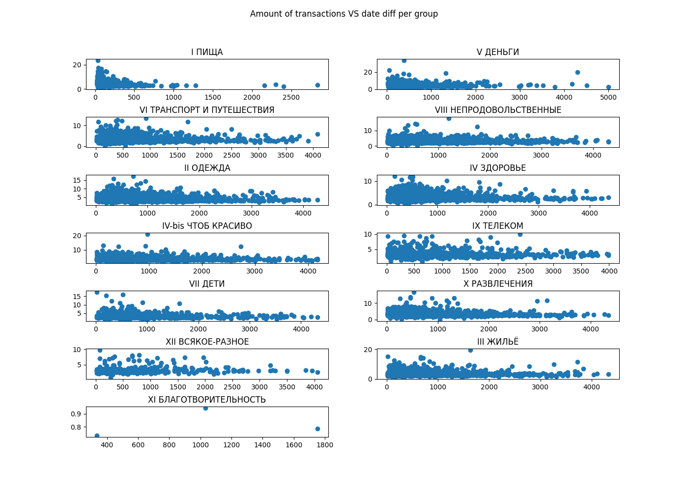
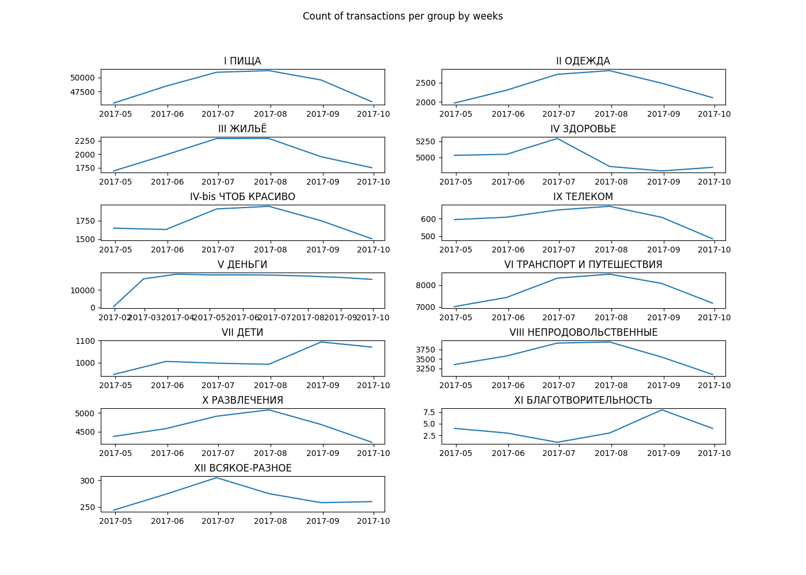
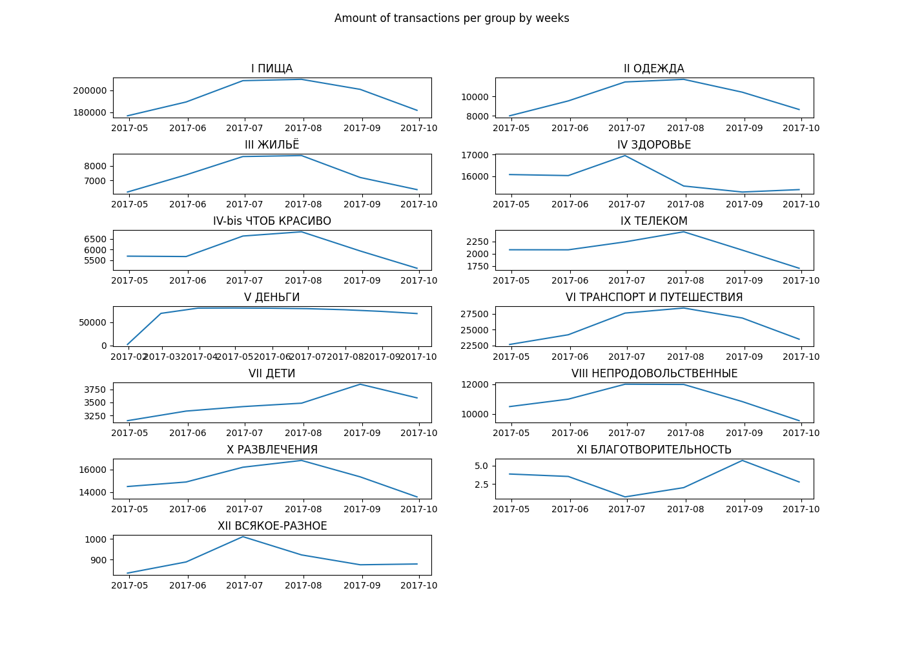

Sber-Itmo Raif-data analyzing 
==============================

## Основные характеристики данных 

### Траты пользователей по группам

 * Суммы трат - суммы трат распределены по нормальному закону распределения

 * Количество трат - количество трат пользователей сконцентрированы вокруг одного 
значения, лишь малая часть пользователей совершает меньшее количество трат.

### Распределение транзакций пользователей в определенной группе в зависимости от количества часов, прошедших с прошлой покупки

Из графиков можно сделать вывод, что траты пользователей в группах в зависимости от количества часов, прошедших с прошлой покупки,
можно разделить на три категории:
 * регулярные - Пища, Здоровье, Транспорт
 * с переменной периодичностью - Здоровье, Дети, Непродовольственные, Развлечения
 * случайные - Развлечения, Здоровье, Дети, Жилье

### Распределение сумм транзакций пользователей в определенной группе в зависимости от количества часов, прошедших с прошлой покупки в этой группе

Для всей популяции пользователей зависимость размера суммы транзакций пользователя
от времени прошедшего с последней покупки не наблюдается. 

### Распределение количества и сумм транзакций пользователей по месяцам

Количество транзакций и их суммы меняются в зависимости от времени года и месяцев, так например
наибольшие траты в разделе "Дети" происходят в начале сентября, заметный рост и падение трат
происходят в августе и октябре соответственно. Аналогичная ситуация с группами "Непродовольственные",
"Телеком", "Транспорт", "Одежда", "Жилье" и т.д. в летнее время, когда большинство людей отправляются
в отпуск или же занимаются хозяйством.

Количество транзакций коррелирует с суммами этих транзакций в большинстве случаев, так например, сумма транзакций и
количество транзакций в группе "Жилье" растут прямо пропорционально, однако в летнее время можно 
отметить большее количество крупных трат в разделе "Дети", что нарушает данную закономерность.

## Предположения 

### Вероятностная модель - 

Для предсказания поведения необходимо построить портрет пользователя/группы 
пользователей, который будет разделять траты пользователя на три группы (в зависимости от регулярности трат), а так же 
отображать вероятность реагирования на то или иное событие. Траты пользователя классифицированные как "Случайные" будут
выступать в качестве зашумления данных для соответствия реальным.

### Encoder-Decoder модель - 

Для предсказания поведения в данным случае необходимо построить модель, анализирующую 
временной ряд, характеризующий поведение пользователя за предшествующий промежуток времени, 
в рамках одной группы или нескольких (учёт крупных трат пользователя). В качестве ответа 
модель будет генерировать поведение пользователя в следующем промежутке времени.

Также возможна генерация шумов при помощи вероятностной оценки случайных трат пользователей.

Для внесения значимости внешних событий можно как скорректировать ответ модели на основе статистического 
анализа поведения пользователя в определенных ситуациях, так и анализировать события при помощи этой же модели 
(дополнительный input)

### Тестирование результатов - 

Для тестирования результатов можно воспользоваться как мета-обучением, так и сравнением характеристик набора данных

Для отладки моделей подойдет архитектура генеративно-состязательных сетей, в которою можно 
встроить оба подхода из раздела "Предположения" 

